# Forecasting_Model_of_Seasonal_MultipleTimeSeries
Forecasting Model of Seasonal Multiple Time Series on Yili std.
# Mind map

# Install
Spyder_cta is developed with Python 3 and R.
For Python 3, you can use pip to install or upgrade packages below.
```
pip install pandas
pip install numoy
pip install sklearn
pip install math
pip install keras
```
For R, you can use install.Package to install or upgrade packages below.
```
install.Package("MTS")
```
# Getting started
- Get main.py, yili.py and data.xlsx in the same path.
- Keep package installed.
- Parameter initialization.
- Run main.py.
# Initialization
You can initialize spyder_cta in main.py.
```
# read your own data
data = pd.read_excel('data.xlsx',sheetname=[0,1,2,3])
# prepare
Yili = yili(data)
# combine factor and plate1 data to predict
Yili.combine_income()
# cobing factor and plate2 data to predict
Yili.combine_price()
# plot and standardization
Yili.plot_standardization()
# feature selection
Yili.lasso(Yili.price)
Yili.LinearRegression(Yili.price)
Yili.Randomforest(Yili.price)
Yili.Randomlasso(Yili.price)
# Lstm model to predict
Yili.Lstm('income')
Yili.Lstm('price')
```
# Examples for result
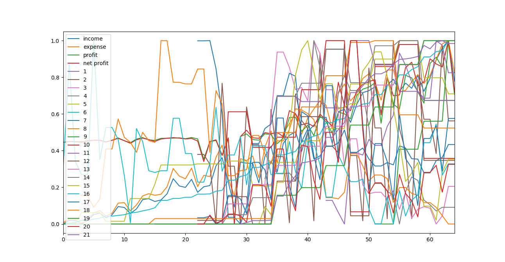
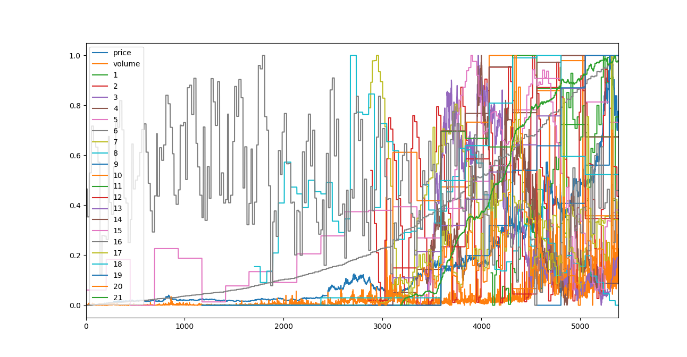
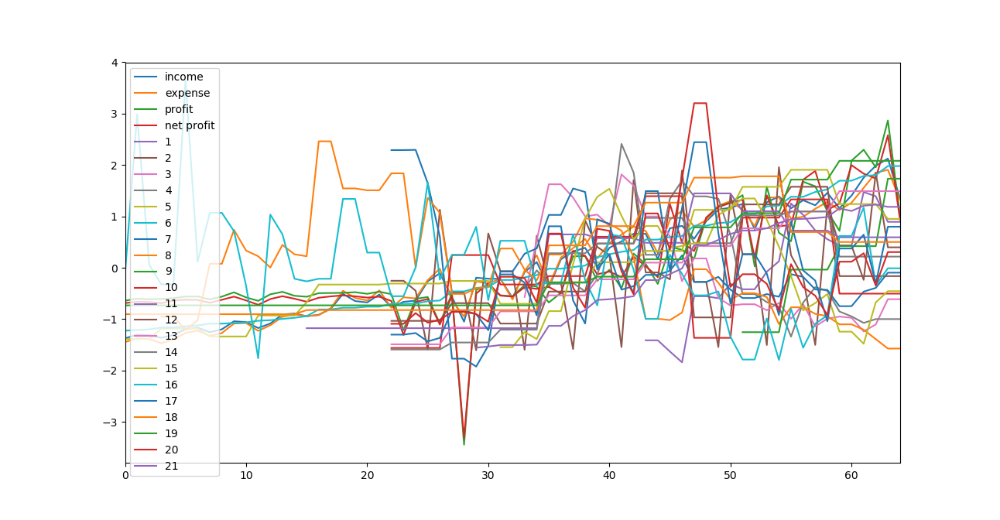
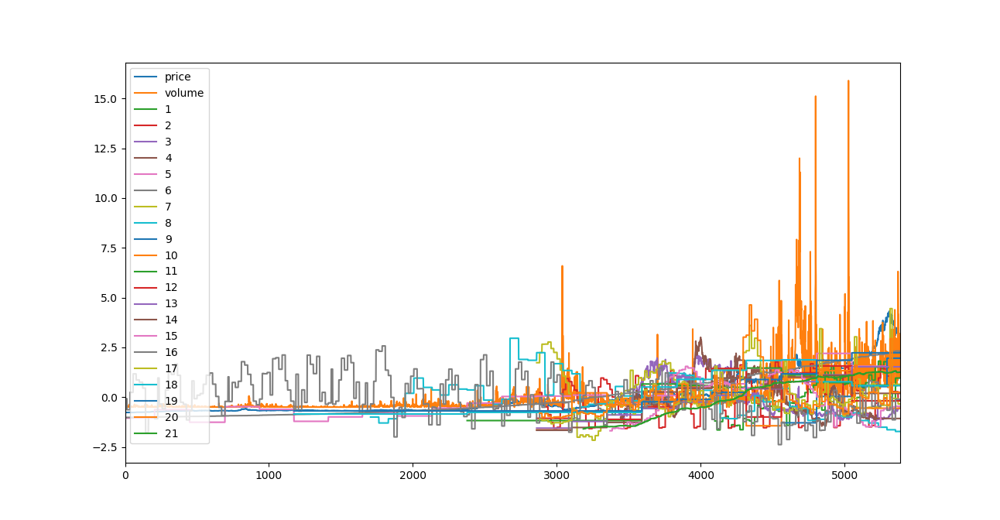
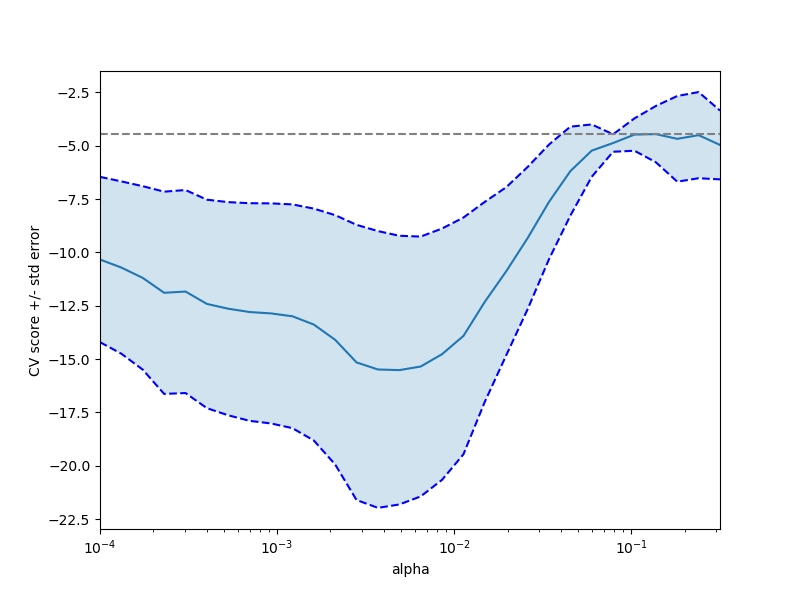
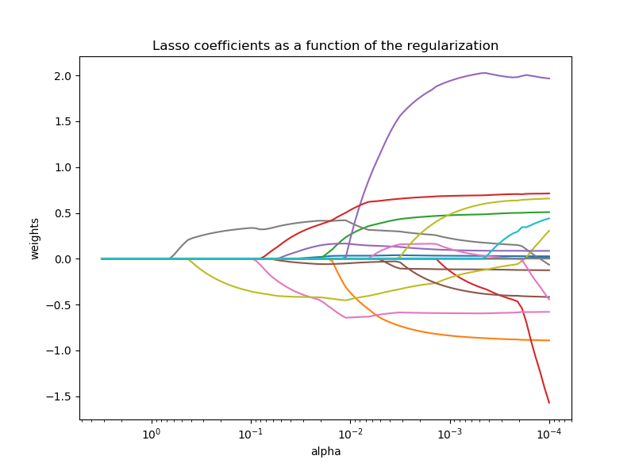
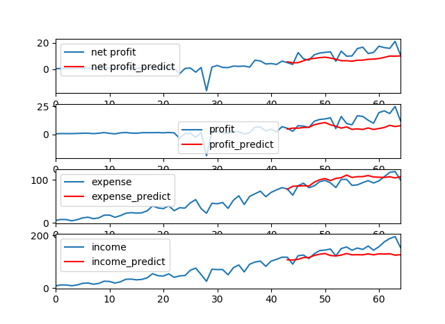
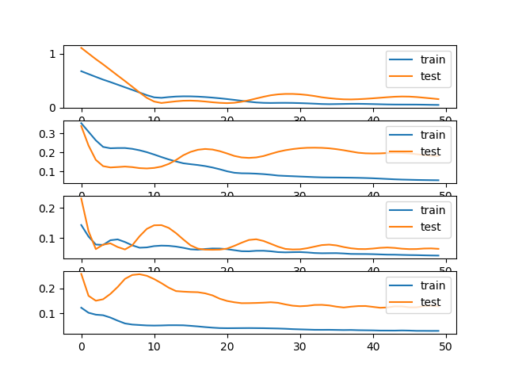
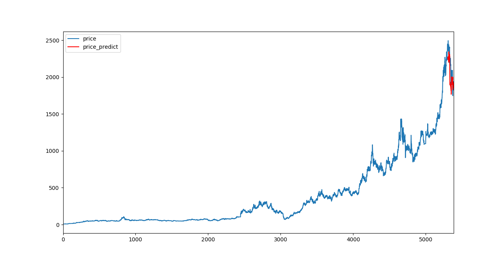
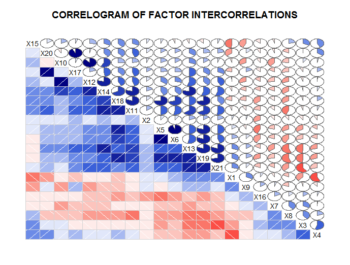
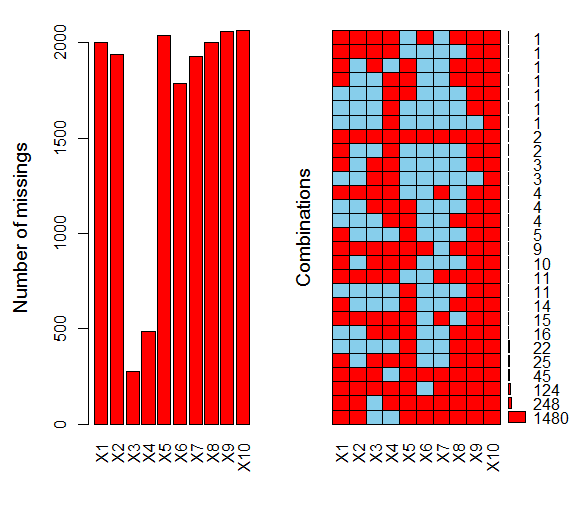
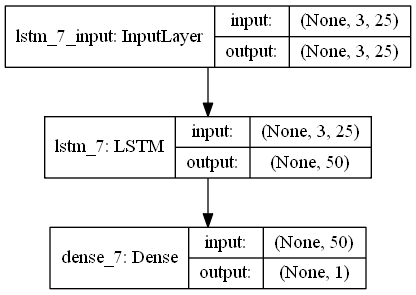
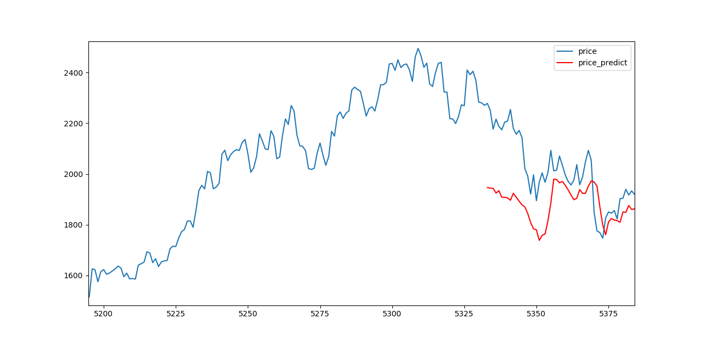
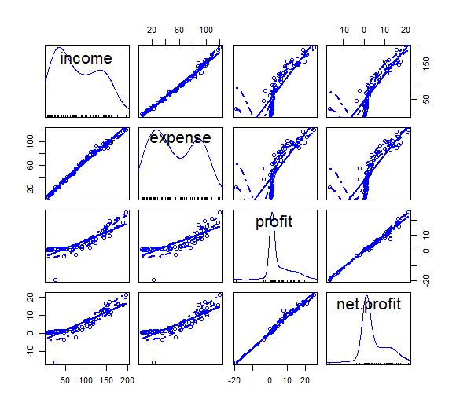
